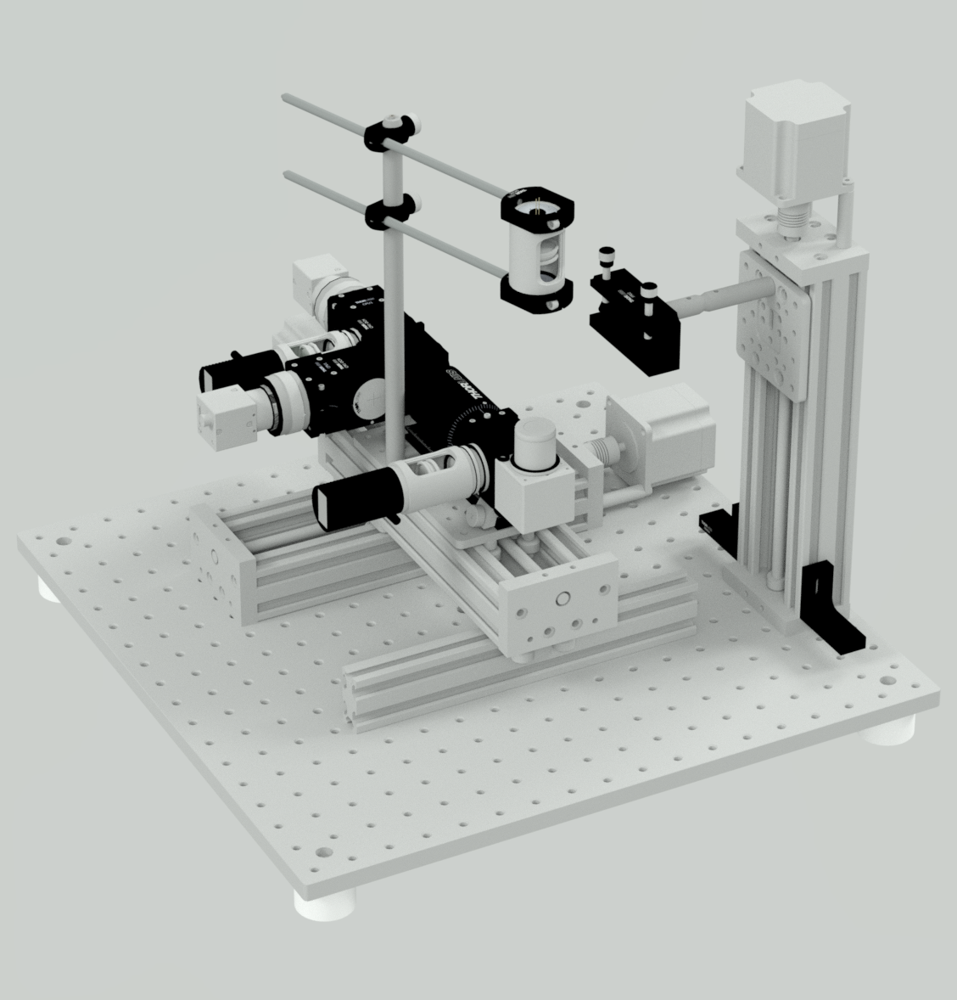
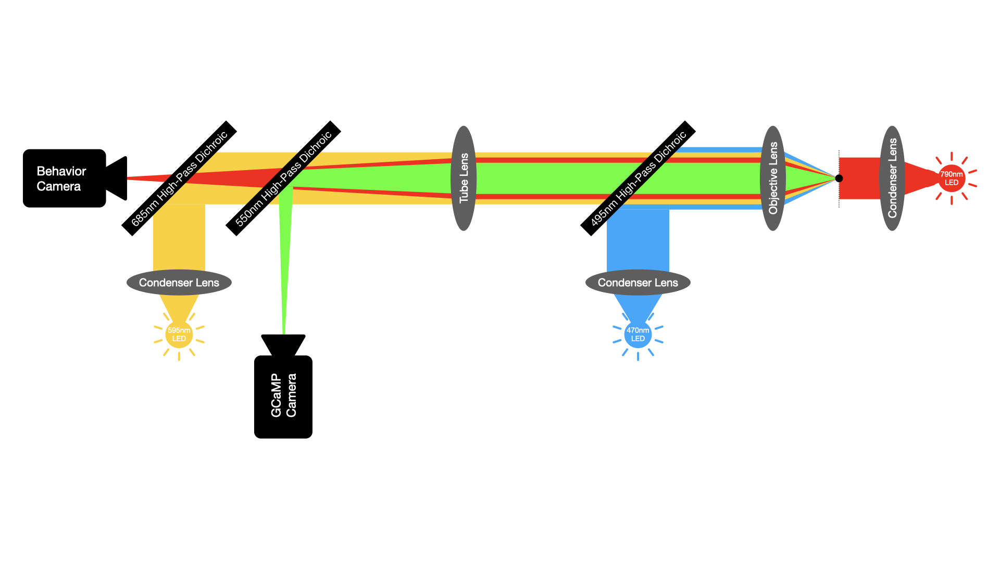
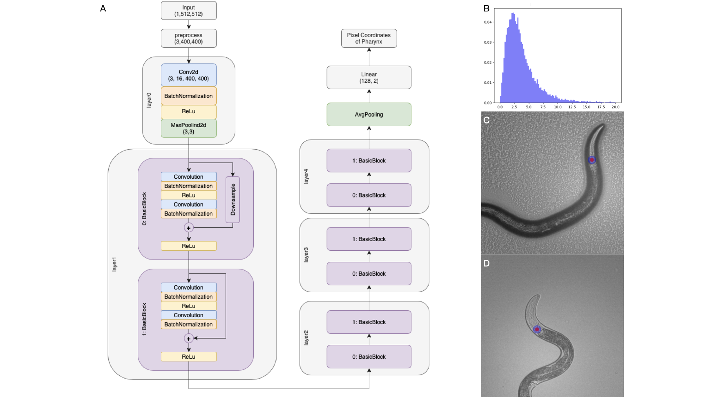

# OpenAutoScope2.0

    
    

# About

The OpenAutoScope is a compact dual-channel microscope engineered to enable precise tracking of single nematodes  (_C. elegans_) and facilitate optogenetic experiments. This imaging system allows recording behavior and dynamic fluorescence (e.g. GCaMP) from a small number of well-separated cells while simultaneously delivering non-targetted light stimulation.

# Hardware Design
OpenAutoScope2.0 houses optical components in a compact design, mounted on an xy motorized stage. A tracking system ensures the sample remains stationary in the xy-plane while permitting movement in the z direction. There are three distinct light paths: an IR path for behavior, a 595nm path for optogenetic stimulation, and a 470nm path for fluorescent imaging in a GFP channel. To simultaneously focus on the sample for both behavior and GFP imaging, we have included an adjustable tube lens and a separate 5mm travel range for each camera.

  

# Software Design
OpenAutoScope2.0 comes with an open-source software primarily written in Python. Its architecture comprises multiple devices, each responsible for controlling a specific hardware component or performing a designated task. Communication between these devices occurs through the ZeroMQ messaging library.

The system utilizes two FLIR cameras for imaging purposes. To interface with these cameras, specific Software Development Kits (SDKs) are required. Detailed instructions for installing and configuring these SDKs are provided in the [installation](documentation/installation.md) section of the software documentation.

  

# Tracker Design 
To ensure robust and accurate tracking of worms at various developmental stages, we have incorporated a customized version of the [ResNet18](https://arxiv.org/abs/1512.03385) deep CNN. This modified architecture is optimized to minimize inference time while maintaining reliability. Training the network involved utilizing a comprehensive dataset of over 17,000 annotated frames, where the terminal bulb was annotated. In Panel A of the accompanying figure, the architecture of the network is depicted, showing the changes made in the number of planes for each layer. The fully connected (FC) layer has been modified to output two coordinates, representing the y and x positions respectively. In Panel B, the histogram of squared error (SE) losses for the test data is plotted, providing insights into the performance of the network. Additionally, Panels C and D showcase images of worms at the L4 and young adult stages, respectively. In Panel C, the worm is situated on a seeded plate, while in Panel D, it is positioned between the agar pad and the glass (for detailed instructions on sample preparation, refer to [this resource](documentation/sample_preparation.md)). The annotated points are represented by red dots, while the blue circles correspond to the output generated by the trained network.

  

