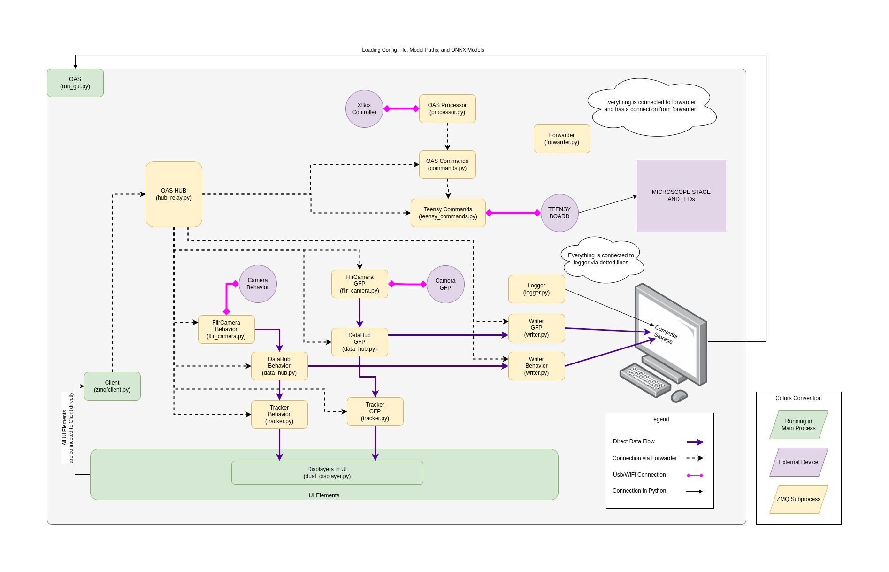

# OpenAutoScope2.0

    
    

# About

Introducing OpenAutoScope2.0: a compact dual-channel microscope engineered to enable precise tracking of a single c.elegans and facilitate optogenetic experiments. This imaging system excels in recording the behavior and gcamp signal of the specimen, while simultaneously delivering controlled light stimuli for comprehensive investigations. Leveraging a combination of image processing techniques and convolutional neural networks, OpenAutoScope2.0 demonstrates exceptional proficiency in detecting the worm's head for reliable hours-long tracking.

# Hardware Design
OpenAutoScope2.0 showcases an assembly of optical components in a compact design, mounted on the x-y motorized stage. This system ensures the sample remains stationary in the x-y direction while permitting movement solely in the z direction. It encompasses three distinct light paths: utilizing IR light for behavior imaging, employing 595nm light for optogenetic stimulation, and 470nm light for calcium imaging. To guarantee simultaneous focus on the sample for both the behavior camera and the gcamp camera, design considerations have been implemented. These include adjustable tube lens position and incorporating a separate 5mm travel range for each camera.

  

# Software Design
OpenAutoScope2.0 comes with an open-source software primarily written in Python. Its architecture comprises multiple devices, each responsible for controlling a specific hardware component or performing a designated task. Communication between these devices occurs through the ZeroMQ messaging library.

The system utilizes two Flir cameras for imaging purposes. To interface with these cameras, specific Software Development Kits (SDKs) are required. Detailed instructions for installing and configuring these SDKs are provided in the [installation](documentation/installation.md) section of the software documentation.

  

# Tracker Design 
To ensure robust and accurate tracking of worms at various developmental stages, we have incorporated a customized version of [ResNet18](https://arxiv.org/abs/1512.03385) deep CNN into our system. This modified architecture is optimized to minimize inference time while maintaining reliability. Training the network involved utilizing a comprehensive dataset of over 17,000 annotated frames, where the terminal bulb was annotated. In Panel A of the accompanying figure, the architecture of the network is depicted, showing the changes made in the number of planes for each layer. The fully connected (FC) layer has been modified to output two coordinates, representing the y and x positions respectively. In Panel B, the histogram of squared error (SE) losses for the test data is plotted, providing insights into the performance of the network. Additionally, Panels C and D showcase images of worms at the L4 and young adult stages, respectively. In Panel C, the worm is situated on a seeded plate, while in Panel D, it is positioned between the agar pad and the glass (for detailed instructions on sample preparation, refer to [this resource](documentation/sample_preparation.md)). The annotated points are represented by red dots, while the blue circles correspond to the output generated by the trained network.

  

