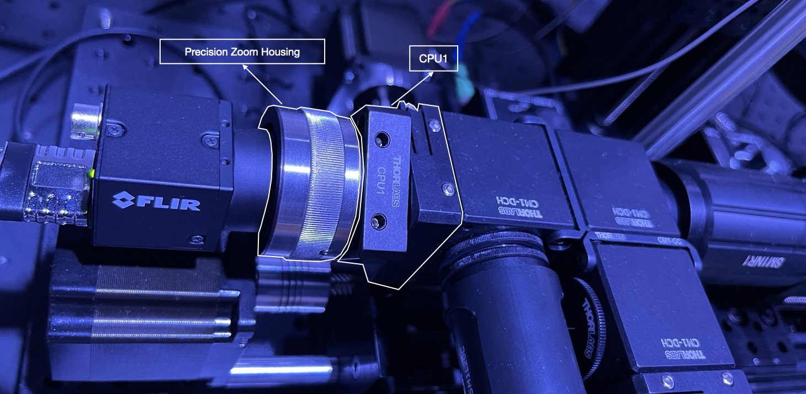

# Calibration and Parameter settings

If you've reached this point, we assume that you have completed the hardware assembly, installed the software, familiarized yourself with the parameter file, 
read about how to utilize the GUI or Xbox controller for stage movement.

### Power Supply

To ensure functionality, three devices must be connected to power supplies. The PCB board and two LED controllers require individual power sources. 
For the PCB board, use the 5A power supply. As for the LED controllers, the power adapter provided by Thorlabs is suitable for their operation.

### LED Contoller

To determine the maximum allowed current for the 470nm LED and the 595nm LED, refer to their respective specification sheets. These documents provide information
regarding the recommended operating conditions. Additionally, on the back of each LED controller, you will find a potentiometer that enables you to set the maximum output current.
To adjust the current, use a small flat screwdriver to turn the potentiometer. Carefully rotate it until you reach the desired maximum output current level for each LED. 

  

Once you have properly adjusted the max current for the LEDs and ensured that the LED controllers are connected to their respective power adapters, the next step is to set
the mode to 'MOD.' This mode enables the control of the output current using the PCB, which is connected to the LED controller through a BNC cable.

For this, follow these steps using the top panel of the LED controller:  
  1- Adjust the mode setting to 'MOD.'  
  2- Turn the knob clockwise until you hear a click. This click indicates that the circuit is activated and the current can flow.
It is worth noting that the specific value you set the knob to does not matter in this case, as the output current is controlled through the PCB rather than the knob on the LED controller.

  

### Stepper Motor Drivers

To ensure the proper functioning of the stepper motor drivers and prevent overheating, it is necessary to set the maximum output current using the potentiometers located on them. For this follow these steps:  

1- Run the system to engage the stepper motors (open a command prompt and enter `activate oas && oas`)  
2- Use a voltmeter to measure the voltage between the specified pins on the stepper motor drivers.  
3- With the voltmeter connected, locate the potentiometer on each stepper motor driver and use a small flat screwdriver to adjust it. Gradually turn the potentiometer until the voltage reading reaches 0.2V.  

An alternative method that can make the voltage measurement easier is to connect one terminal of the voltmeter to the flat screwdriver and insert it inside the potentiometer.

  

### Teensy Port

During the [installation](installation.md) process (Arduino Software section), you utilized the Arduino app to identify the port to which the Teensy board is connected. It is crucial to make a note of this port and enter it correctly in the [configuration file](../configs.json). This step ensures proper communication between the software and the Teensy board, enabling seamless functionality and data transfer.

### Blackout Cover

To ensure that the lighting conditions in the room where the system is located do not interfere with the imaging sessions, follow these steps:  

1- Stack two 0.5-inch optical posts, one measuring 10 inches and the other 6 inches in height to make four longer posts.  
2- Use 1/4-20 set screws to securely mount the four longer posts on the corners of the breadboard.  
3- Cover the entire system with black nylon fabric. This fabric acts as a blackout material, minimizing external light interference during imaging sessions.  

### Cameras

To perform the three calibration steps for the image plane, follow these instructions:  

1- Go to the [configuration file](../configs.json) in the repository, open it, and change the parameter 'q' to 0.  
2- Run the system by opening a command prompt and typing `activate oas && oas`.  
3- Turn on the IR LED and adjust the stage to focus the behavioral camera on the stacked calibration slide.  
4- Turn on the 470nm LED, using a low laser power and/or low exposure time to minimize potential saturation.  
5- Rotate the precision zoom housing to ensure that the GCaMP camera is also focused on the stacked calibration slide. If necessary, make adjustments to the position of both cameras.  
Note that the precision zoom housings were initially set to their mid-travel range during assembly.  
6- Utilize the CUP1 parts to rotate each camera and ensure that the images in both channels have the same orientation. The CUP1 allows you to rotate the camera without changing its position.

  

7- Use the offset buttons on the GUI to adjust the offset values for both the x and y axes for each camera. Fine-tune these values to achieve perfect alignment and ensure that the images are precisely aligned.  
8- Record the final offset values that resulted in perfect alignment in the [configuration file](../configs.json) and change the parameter 'q' to 0.7 (or any other desired value)  

Ther fisrt image shows the ovelay image before adjusting the offset values and the second image is after the adjustment.  

  

  

