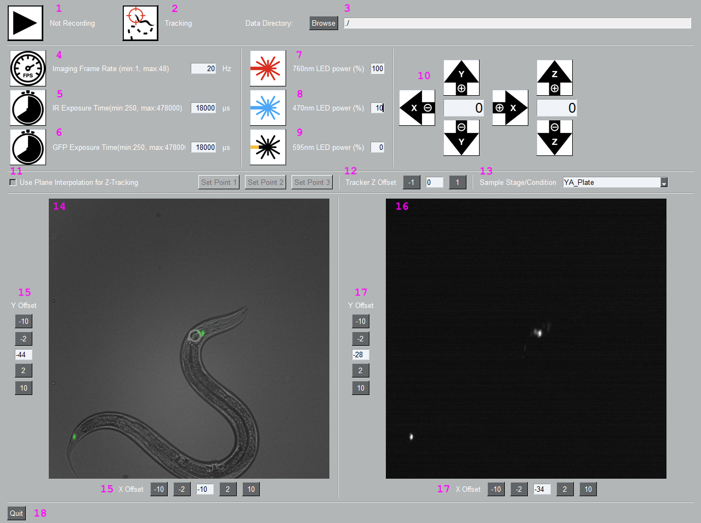

# Graphical User Interface (GUI)

If you have successfully completed the previous steps, you can run the system by entering the following command into a command prompt window, regardless of the current directory:
```
activate oas && oas
```
The software's graphical user interface (GUI) resembles the image displayed below.
  
<p align="center">
  
</p>

### 1: Recorder Toggle
This button serves as a toggle for recording. The current recording status, indicating whether recording is active or not, is displayed next to the button.
Once the recording begins, two HDF files and a log file are generated at the location specified in __Data Directory__.

### 2: Tracker Toggle
This button functions as a toggle for tracking. The tracking method is determined by __Plane Interpolation Z Tracking__,
__Tracking's Z Offset__, and __Tracking Mode__.
The current tracking status, indicating whether tracking is active or not, is displayed next to the button.
### 3: Data Directory
Here, you can specify the location where the log file and data are saved. It is recommended to create separate folders for each recording session.
### 4: Imaging Frame Rate
You can set the imaging frame rate here. The minimum and maximum allowed values are indicated in parentheses. For most behavioral experiments, a frame rate of 20Hz is sufficient.
Keep in mind that higher frame rates will increase the size of the recorded data, and certain tracking methods may require more computational resources,
potentially leading to tracking issues.
### 5: GFP Camera Exposure Time
This parameter determines the exposure time for the camera recording the behavior (left displayer). The minimum and maximum values depend on the current frame rate
__Imaging Frame Rate__. Setting a high exposure time can lead to the loss of features due to saturation.
### 6: Behavior Camera Exposure Time
This parameter controls the exposure time for the camera recording the GFP signal (right displayer). The minimum and maximum values depend on the current frame rate
__Imaging Frame Rate__. It is important to avoid increasing this parameter excessively to prevent camera saturation, which can compromise the extraction of meaningful GCaMP signals.
### 7: IR LED Toggle
This button serves as a toggle for the IR LED, which acts as the light source for behavior recording.
The LED can only be turned on or off; therefore, the intensity is fixed at 100 and cannot be adjusted.
### 8: 470nm LED
This button functions as a toggle for the 470nm LED, serving as the light source for the green fluorescent proteins. The LED can be switched on or off,
and the intensity can be adjusted from 0 to 100 percent. Setting the intensity to 100 percent corresponds to passing the maximum allowed current to the LED.
### 9: 595nm LED
This button functions as a toggle for the 595nm LED, serving as the light source for specific optogenetic experiments. The LED can be switched on or off,
and the intensity can be adjusted from 0 to 100 percent. Setting the intensity to 100 percent corresponds to passing the maximum allowed current to the LED.
### 10: Motion Control
These six buttons enable you to move the stage in the X, Y, and Z directions. The velocity for the X and Y directions is the same but can be adjusted
independently from the velocity of the Z direction. Pressing and holding a button initiates motion in the desired direction, and releasing the button stops the stage's movement.
### 11: Plane Interpolation Z Tracking
This mode is designed for precise Z tracking. To utilize this mode, the sample needs to be prepared on the surface of the glass
(learn more about [sample preparation](sample_preparation.md)). Three points on the glass surface should be marked (using a sharpie, for example).
If the user chooses to use this tracking mode, they should manually adjust the motor in the X, Y, and Z directions to focus on each marked point and then press
the 'Set Point' button. These three points define the plane of the glass surface and will be used to maintain the Z position consistently on this plane.
### 12: Tracking's Z Offset
In case interpolation method is utilized for Z tracking, there's a chance that the neurons or fluorescent elements in the sample might be situated at a different Z position than the target being tracked via the behavior channel. This parameter offers the flexibility to designate an offset, enabling focus on the elements of interest within the GFP channel, even if they're placed at a Z position different from the predicted Z (the result given by the Z tracking algorithm).
### 13: Tracking Mode
There are various tracking algorithms available for capturing motion in the x-y plane. The appropriate method to be used depends on factors such as the magnification of the
objective, imaging conditions (learn more about [sample preparation](sample_preparation.md)), and the developmental stage of the animal (L1, L2, L3, L4, YA). In this section,
you can specify the tracking method to be utilized based on the requirements of your experiment.
### 14: Behavior Displayer
This displays the frames overlaid from the behavior channel and the GFP channel. Before overlaying, a background subtraction is applied to the frame from the GFP channel.
To learn more about how to adjust the level of background subtraction, refer to the [parameters](parameters.md) in the configuration file.The white circle represents the output of the tracking algorithm. It is advised to initiate tracking only if the output aligns with your expectations.
### 15: Behavior Camera Cropping Offset
The displayed images are cropped from the full field of view. These parameters determine the deviation from the center of the full field of view, ensuring alignment between
the images from the two channels. After finding the optimal x and y offset pair, you can enter them in the configuration file. Depending on your system, these parameters may
require periodic adjustments to maintain accurate alignment.
### 16: GFP Dispalyer
This displays the frame from the GFP channel. The presence of high levels of background noise can be attributed to two main factors: poor sample preparation and/or high LED power.
### 17: GFP Camera Cropping Offset
The displayed images are cropped from the full field of view, and these parameters control the deviation from the center of the full field of view. Their purpose is to achieve
alignment between the images from the two channels, as described in __Behavior Camera Cropping Offset__. Depending on the sensor size, it may be necessary to adjust the offset in the GFP camera instead
of changing it in the behavior camera in the opposite direction for one particular axis.
### 18: Quit
This closes the software and, ensures that all open files are properly closed before shutting down the system.
