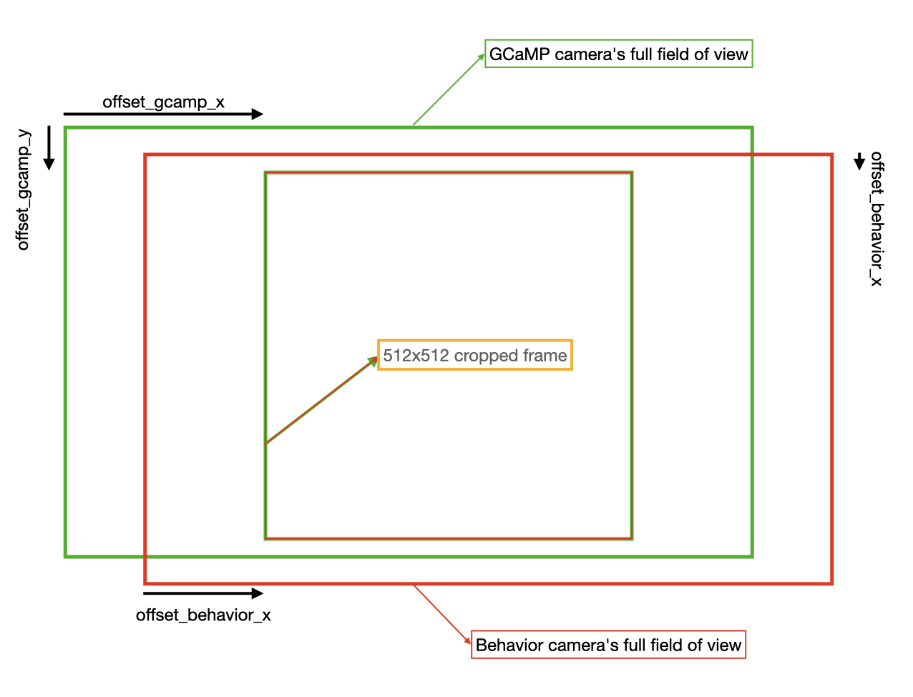

Presented below is a comprehensive list of parameters that you will encounter throughout the assembly, calibration, and utilization of OpenAutoScope 2.0. Familiarizing yourself with these parameters will greatly assist you in maximizing the system's performance capabilities.

### Camera Serial Number
This is a dual-channel system designed for simultaneous behavior recording and GCaMP recording. Essentially, this system utilizes two separate cameras, each positioned in a distinct light path. The camera located further back specifically captures light that passes through all optical components. Due to the implementation of high-pass dichroic mirrors, this camera primarily collects light with longer wavelengths. As a result, it effectively captures infrared (IR) light, which is utilized as the light source for behavior recording. This camera is referred to as the "behavior camera." On the other hand, the second camera is positioned after the 470nm light source but before the 595nm light source, earning it the designation of the "GCaMP camera". The serial number of each camera is written on its label and is also available when you open the SpinView app, under the 'Devices' panel. Make sure the correct serial numbers for each camera is recorded in the [configuration](../configs.json) file.

### Camera Offset values
The cameras used in this system have a sensor size of 1920 by 1200. To optimize signal quality and reduce file size, we implement a resolution reduction by a factor of 2 and utilize a bin size of two. As a result, the full field of view frame size becomes 960 by 600. However, due to the inherent imperfections of the system's components and the assembly process, there may be offsets in both the x and y directions between the two cameras, despite them receiving signals from the same objective. To ensure perfectly aligned frames, we use a cropped version of the frames. Specifically, from the original 960 by 600 field of view, we crop a 512 by 512 frame. By adjusting the location of these crops, we achieve the desired alignment of frames. The following drawing shows how the full field of view and the offset parameters are related.

  

### Imaging Frame Rate (framerate)
The frame rate parameter determines the speed at which both cameras capture images. When you initiate the system, the cameras operate at the default frame rate value. However, you have the option to modify this value within the [graphical user interface (GUI)](gui.md). If needed, you can also adjust the default value within the [configuration file](../configs.json). It is worth noting that the frame rate directly impacts the available processing time for online tasks like object detection, which is crucial for tracking. Therefore, it is advisable to run the system at the lowest frame rate that meets the requirements of your specific experiments.

### Exposure time (exposure_gcamp, exposure_behavior)
The exposure time for each camera determines how long the camera sensors collect incoming light. Although both cameras operate at the same frame rate, they have different durations for light capture. It is recommended to use lower frame rates to allow sufficient time for online processing tasks. However, it is essential to limit the exposure time to prevent camera saturation. If small features in bright areas of the images are disappearing or becoming difficult to discern due to high light intensity, it is advisable to decrease the exposure time. The exposure time for each camera can be adjusted within the [graphical user interface (GUI)](gui.md), and the default values can also be modified in the [configuration file](../configs.json).

### Tracking Model
The tracking functionality in this system utilizes a customized variant of ResNet18. By training the network with different datasets, it becomes possible to fine-tune it for various imaging conditions or specific stages. In the [models_path.json](../models_path.json) file, you have the option to include the path to a particular trained model and assign it a key. As a result, within the [graphical user interface (GUI)](gui.md), you will be able to select the desired model using the corresponding assigned key. Alternatively, you can utilize the default trained models provided for tracking.

### Background Subtraction Quantile
The left display in the [graphical user interface (GUI)](gui.md)  shows an overlay of both channels, with the behavior channel displayed in gray and the gcamp channel displayed in green. Due to background noise in the gcamp channel, the overlaid raw data often results in a green hue. To address this, a background subtraction is performed specifically on the green channel. The threshold for this subtraction is determined by the 'q' parameter, which represents the quantile value. By default, 'q' is set to 0.7, but you can adjust this value in the [configuration file](../configs.json). If you prefer to view the raw data overlay without background subtraction, you can set 'q' to 0, resulting in the display of both channels' raw data in the left display.

### X, Y and Z Speed
The motorized stage offers omnidirectional movement through the use of an [Xbox controller](xbox_controller.md). Additionally, we have implemented a GUI feature that allows users to control the stage's movement. In the [configuration file](../configs.json), you will find default speed settings for both the XY direction (xypad-input) and the Z direction (zpad-input). These values can also be modified directly within the [graphical user interface (GUI)](gui.md).
