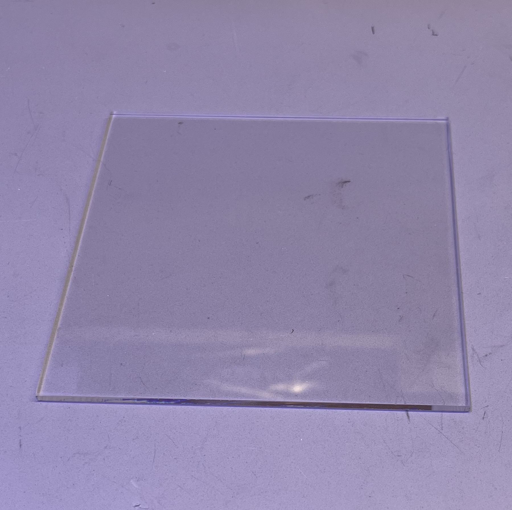

# Protocol: Sample Preparation

## Objective
The objective of this protocol is to prepare samples for single worm tracking using OpenAutoScope2.0. The tracking accuracy heavily relies on the cleanliness of the samples. This protocol demonstrates two different methods of sample preparation: on the plate and on the glass, utilizing NGM plates prepared on 10cm petri dishes.

For imaging durations of a few minutes, an unseeded plate can be used. However, for longer imaging sessions, starved animals may exhibit different behavior, necessitating the use of seeded plates. To minimize interference with tracking, NGM plates with reduced Peptone content are employed. These plates are seeded with a thin lawn of OP-50 bacteria hours before the experiment. Although the trace of the animal on the seeded plates can potentially interfere with tracking, the small amount of food provided is sufficient for the survival of the single animal being tracked.

Furthermore, to minimize background noise in the GFP channel, agarose or noble agar can be used to prepare the plates. These materials increase the transparency of the agar pads, thereby reducing background noise and enhancing image quality.

## Materials

- 10cm NGM plates (low in peptone, made with agarose or noble agar)
- 5"x5" Glass (part of the OpenAutoScope2.0 setup)
- Scalpel
- Sharpie
- OP-50 in LB
- 200ul pipette
- Cell Spreader

    
    
    
    
    
    
    

## Seeding Procedure (for longer imaging sessions):
- Dispense 200 μl of OP-50 bacteria in LB onto the center of the 10cm NGM plate.
- Using a cell spreader or a sterile glass rod, evenly distribute the bacterial solution across the surface of the plate.
- Allow the plate to sit undisturbed for 2-3 hours, or until the bacterial solution has dried completely.

Please ensure that all materials used for dispensing and spreading the bacteria are sterile to maintain the cleanliness of the samples.  

    
    

## Procedure
1- Sample Preparation on the Plate:

 - Pick a worm of interest using a worm pick or platinum wire and transfer it onto the center of the NGM plate.
 - Gently tap the worm pick or platinum wire to encourage the worm to crawl onto the agar surface.
 - Place the NGM plate upside down on a 5"x5" glass slide, ensuring that the surface of the agar plate is facing the objective.

2- Sample Preparation on Glass:
 - Pick a worm of interest using a worm pick or platinum wire and transfer it onto the center of the NGM plate.
 - Use a scalpel to carefully cut the agar around the worm, creating a large rectangle shape with dimensions of approximately 2"x2".
 - Use a scalpel to help lift the agar rectangle (remove the pieces close to the walls of the plate to make it easier to lift the agar pad).
 - Place the rectangular agar pad on the clean 5"x5" glass, ensuring that the worm is trapped between the glass and the agar pad. Carefully roll the agar pad onto the glass to ensure there are no air bubbles trapped between the glass and the agar pad.  
   Note: Ensure that the glass is clean and free from any debris or contaminants.
 - Use a sharpie or marker to mark at least 3 corners of the agar pad on the glass. These marks will be used by OpenAutoScope to define the plane of the glass for precise z-tracking during imaging.  

  

    
    
    
    
    
  

