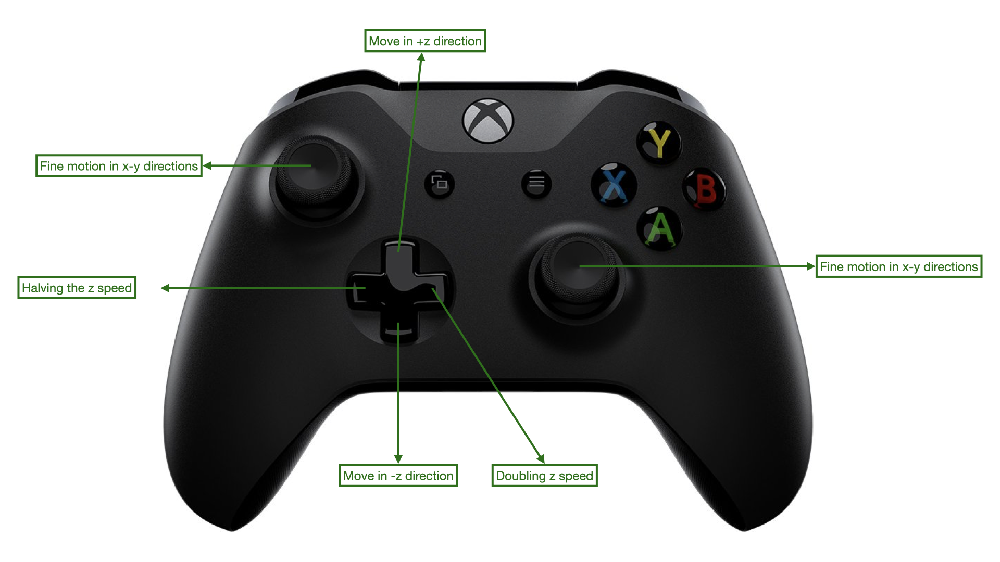

In this system, we have added the benefits of using an Xbox controller for navigating the system, even though the software itself provides various ways to move the stage
in all directions. The Xbox controller is primarily utilized for motion control, although it is possible to assign additional functions to its buttons if desired.

To adjust the z speed, we can utilize the left and right buttons on the controller. These buttons allow us to modify the speed by a factor of 2, either doubling it or halving it.
The default speed when the software is opened is 1, representing the minimum speed, while the maximum speed achievable is 1024.
This feature grants us flexibility and control over the system's motion, enhancing the overall navigation experience.

Please note the following important information: When pressing the up or down buttons, commands are sent to the motorized stage to initiate motion,
and releasing these buttons sends stop commands. However, it is crucial to be aware that if other commands, such as navigation in the x-y direction,
are immediately sent after releasing the buttons, there is a possibility that the stop command may be ignored. To prevent this issue, it is recommended
to ensure that releasing the up or down buttons is the last action performed, followed by a half-second delay before proceeding with the next action.
This precautionary delay helps to avoid any unintended and continuous movement of the motors in a single direction.

  

